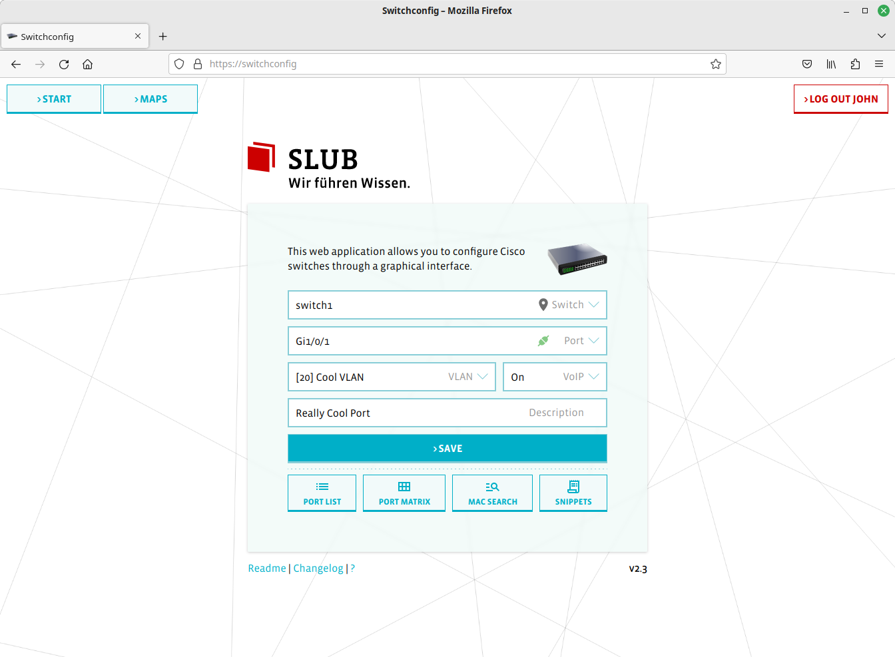
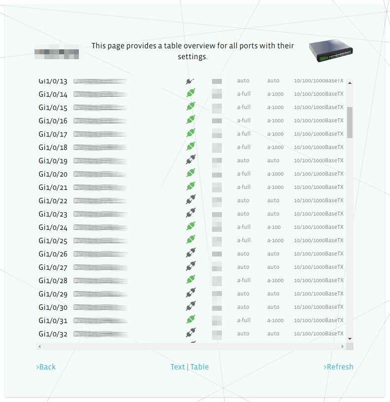
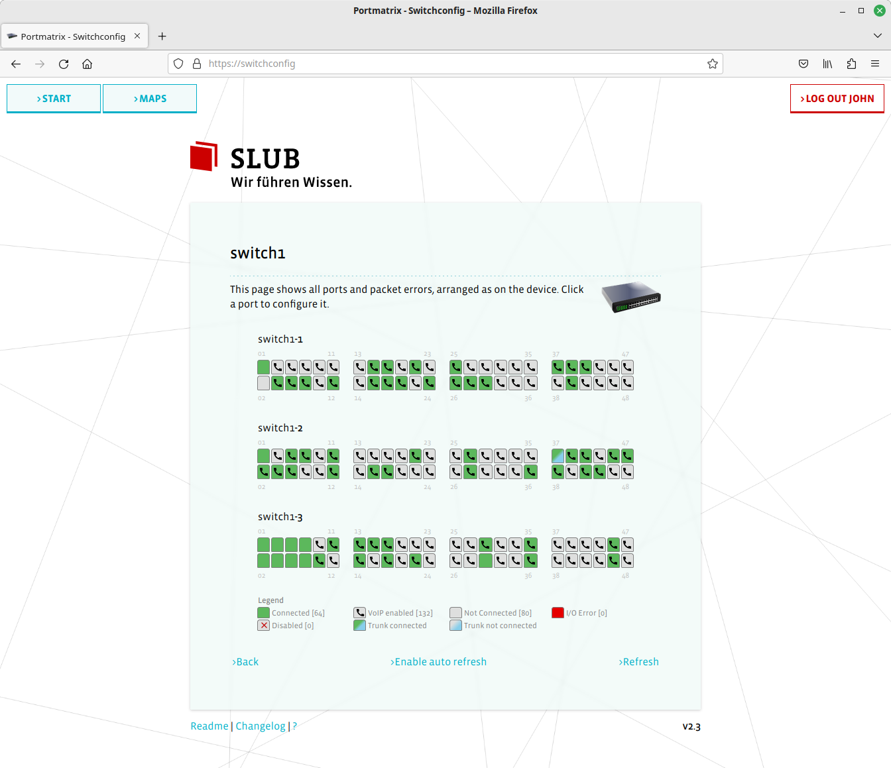
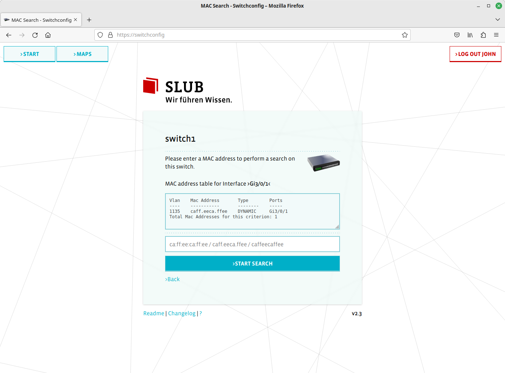

# Switchconfig
Web application for managing cisco switches via SSH

## Features
- assign description, VLAN and VoIP-capability to a switchport
  - trunk ports are hidden by default to avoid accidentally changes on those ports
- webserver connects to switches via SSH
- create maps with the position of your switches
- overview over the usage of your switch using the port matrix or port list
- mac address search
- bulk password change for one user account on all switches
- optimized for mobile devices
- dark mode!!

## Dependencies
- Server
  - linux-based operating system (Debian/Ubuntu recommended)
  - apache2 webserver
  - PHP 5 or 7 with php-ssh2 package
- Client
  - Browser with JavaScript enabled
  - Chromium or Firefox recommended
  - Internet Explorer is not supported

## Setup
0. Install packages (example for Debian): `apt install apache2 php php-ssh2`
1. Copy all files into your webserver directory
2. Make sure "AllowOverride All" is set in your Apache config for the webserver directory, in order to deny access to the "maps" directory for non-authenticated users (see .htaccess file in this directory).
3. Create/Edit the config file __switchlist.php__ (please refer to the explanation and example in the file __switchlist.php.example__)
   - add the vlans you need to the array __VISIBLE_VLAN__
   - add the switches you want to manage to the array __SWITCHES__ (at least one)
   - (optional) set the __VOICE_VLAN__ (integer)
   - (optional) enable the password change feature
   - (optional) create maps using the array __MAPS__
4. Open __index.php__ in your browser, log in with an SSH account on your switch and your LDAP account if configured.

## Hardening Recommendations
- Please only use HTTPS (except you are accessing the site only via localhost). Redirect all HTTP requests to HTTPS.
- Keep your server always up to date.
- Limit the access (via Apache config) to IP addresses that really need it.
- Do not make this webapp availabe on the internet (to avoid brute force attacks) - configure your Apache and/or firewall to only serve this page inside your internal network.

## Other Recommendations
- LDAP Authentication: You can configure your switches to ask a RADIUS server (which can for example authenticate against an LDAP/AD server) for authenticating the SSH connections.

## Compatibility Note
This application parses the SSH response from your switch. Therefore, your switch has to produce output in a specific format as shown in __docs/Example-SSH-Output.txt__ in order to be compatible with this application. Please check if your switch supports the necessary commands (and syntax) in the example file and if it produces similar output.

## Feedback
I'm interested if your switch model is compatible (or not) with this application. Please let me know on Github (make an Issue) or via email. Thanks!

## Screenshots

## Third-Party Components
- SVG-Loader by SamHerbert, MIT License  
  https://github.com/SamHerbert/SVG-Loaders
- Material Icons, Apache License 2.0  
  https://material.io/tools/icons
- Switch & Key Icons from draw.io  
  https://draw.io

## License
GPL v3, see LICENSE.txt
